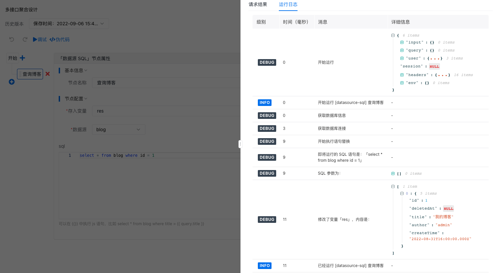

# 数据源SQL节点

数据源SQL节点主要是通过用户自定义编写原生SQL语句的方式直接对数据源进行操作, 主要适用于复杂的SQL使用（例如多表JOIN, 复杂条件过滤, 原生函数使用等场景）。

## 如何使用数据源SQL节点
1. 在API中心创建类型为**多接口聚合类型**的API
2. 点击创建好的多接口聚合API, 进行多接口聚合设计
3. 添加类型为**数据源SQL**的子节点, 设置节点名称, 存入变量名称, 指定需要操作的数据源, 填写需要执行的SQL
4. 可以通过调试按钮实时查看SQL运行结果

## 常用语法示例
### 简单SQL

执行基本的 SQL 语句
```
select * from blog where id = 1
```
相关配置 和 调试日志如下:


### 动态SQL—变量替换

在 SQL 语句里用 `{{}}` 包裹的部分可以执行 JS 语句，实现包括上下文参数传递在内的灵活处理，比如：
```
select * from blog where title = {{ input.title }}
```

它的实现原理是最终转成 `select * from blog where title = ?`，然后将 `input.title` 的值作为后续参数填入，因此默认会进行变量转义，防止 sql 注入

### 动态SQL—数组替换

如果数据是一维数组，使用如下写法

```
select * from blog where title in ({{ input.titles}})
```

如果是二维数组，比如下面的 `input.blogs` 是 `[['标题1', '内容1'], ['标题2', '内容2']]`，使用如下写法

```
INSERT INTO blog VALUES {{ input.blogs }}
```

或者指明字段

```
INSERT INTO blog (title, content) VALUES {{ input.blogs }}
```

如果数据是对象数组形式，需要先转成二维数组，可以用 js 节点操作，比如

```
module.exports = async function (event, state) {
  state.blogs = [state.input.blogs.map(item => [item.title, item.content])];
  return state;
};
```

### 动态SQL—条件执行

如果要实现有参数时才查询，可以用如下写法

```
select * from blog where ( {{ !input.title }} OR title = {{ input.title }} )
```

这个语句在输入参数有 `title` 的时候，会变成

```
select * from blog where (FALSE OR title = ?)
```

如果输入参数里没有 `title`，则会变成下面的语句，可以看到前面的条件是 true，所以 or 里的条件不会生效。

```
select * from blog where (TRUE OR title = ?)
```

### 动态SQL—关键字&列名处理

如果输出的内容是 sql 关键字或列名，不能使用之前的语法，比如

```sql
# 这个写法的错误的
select * from blog order by {{title}}
```

原因是这个写法会变成 `select * from blog order by ?`，而通过变量替换后，就变成了 `select * from blog order by "title"`

如果要输出关键字或列名需要使用 `#{{}}` 来包裹

```sql
select * from blog order by #{{title}}
```

在这种写法下会原样输出内容（会滤掉分号、双引号、逗号等特殊字符，但不会去掉空格），如果 title 的内容是 a，输出结果就是

```
select * from blog order by a
```

如果 title 内容是个数组，比如 `['a', 'b']`，输出结果将会是

```
select * from blog order by a, b
```

因为它会去掉引号，所以不能直接用在变量的场景，比如

```
select * from blog where title = #{{query.title}}
```

需要自己加引号，但不推荐用这个语法来实现动态内容，下面的场景最好还是用 `{{}}`

```
select * from blog where title = "#{{query.title}}"
```