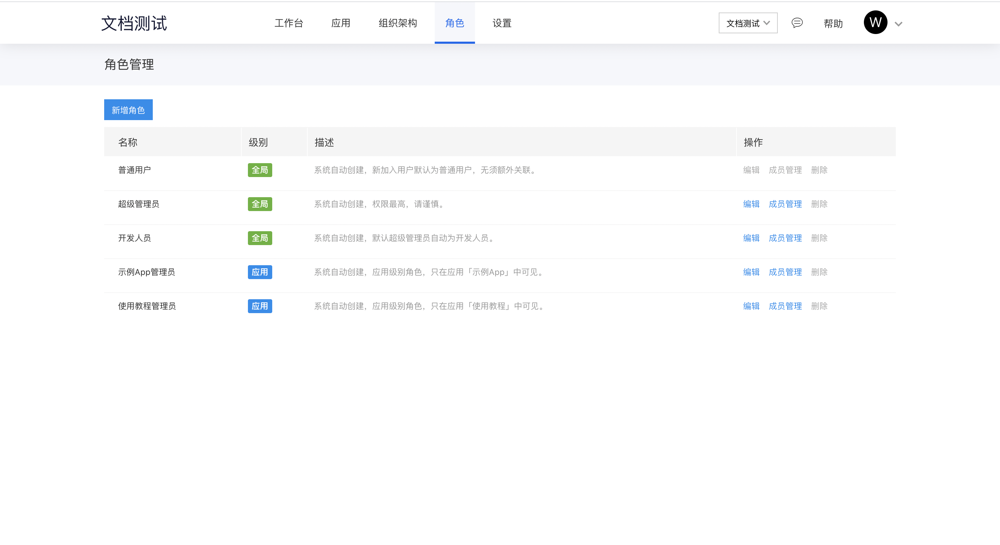
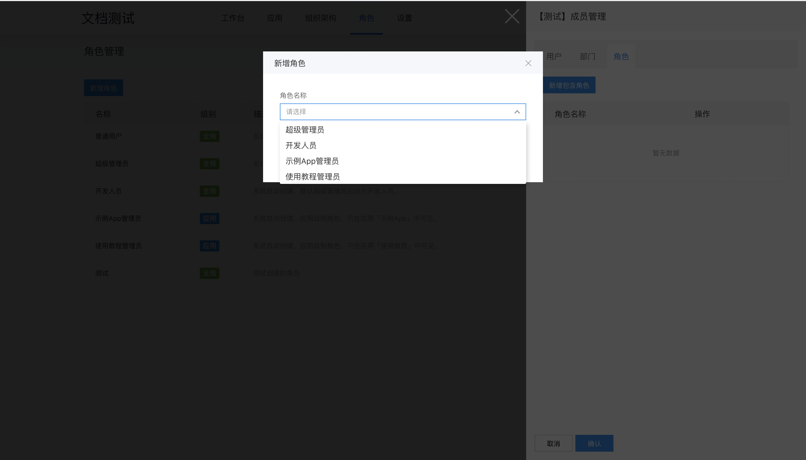

## 角色管理

角色是标识成员权限的一种方式，通过角色管理，可以方便系统权限的设置和管理

## 基本介绍

默认有 普通用户、超级管理员 和 开发人员 三种角色，对于新增的应用，会自动创建应用管理员角色，该角色仅作用于该应用内。

## 新增角色

可以根据需要新增角色，并添加角色描述。

## 成员管理

支持对除普通用户角色外的所有角色进行成员管理，可以为角色新增成员、部门或关联其他角色，但新增和关联的对象只能是系统已有的人员、部门和角色。

- 关联成员

- 关联部门

- 关联角色

> 角色本身不具备权限，作为标签，关联成员。在权限管理过程中，可以通过将权限和角色相关联来快速实现对成员的权限管理。
