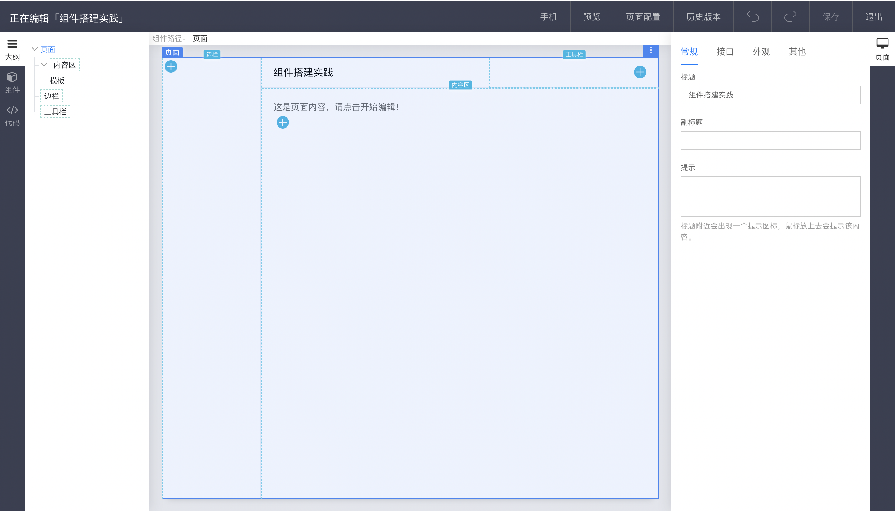
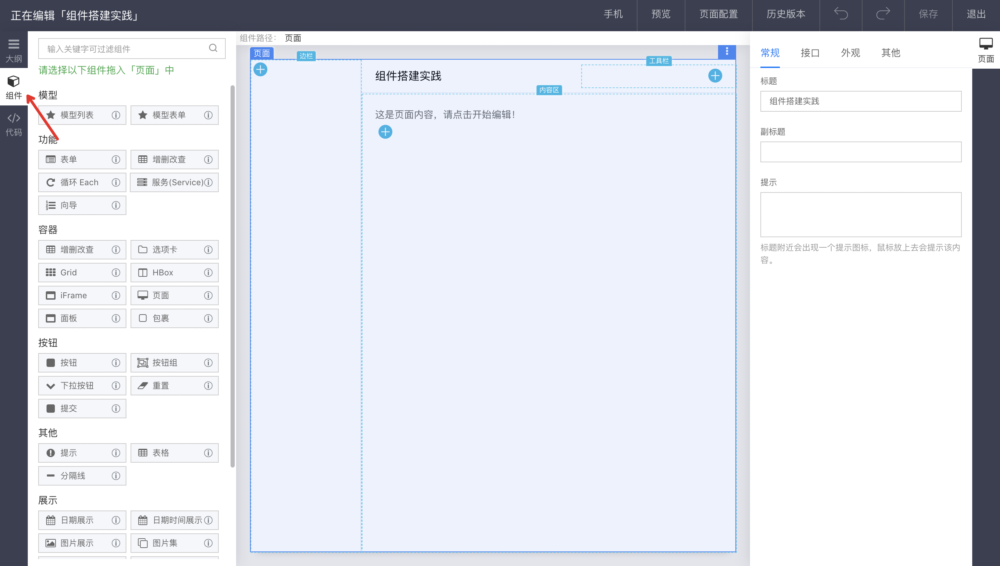
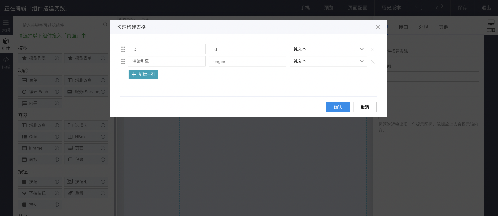
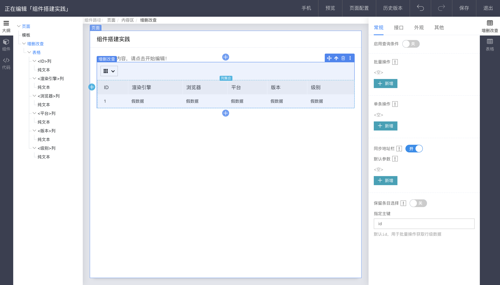
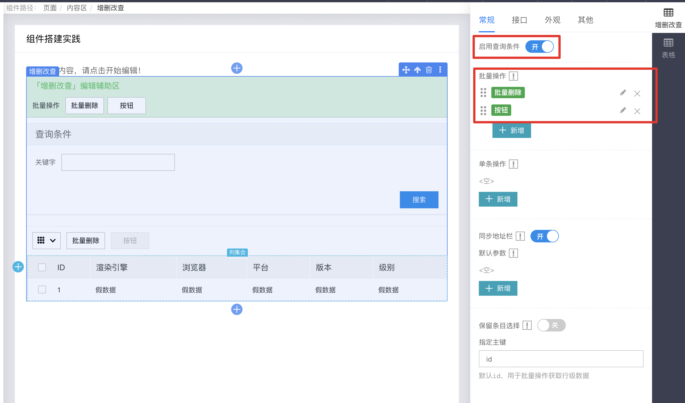
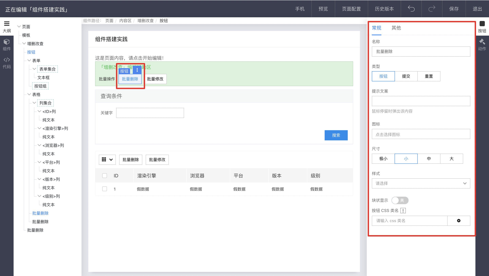
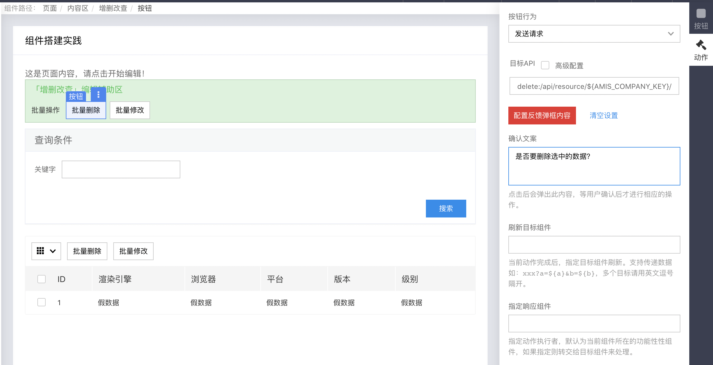
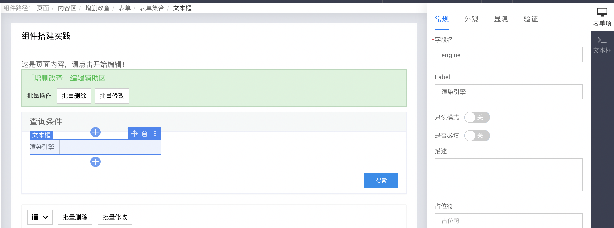
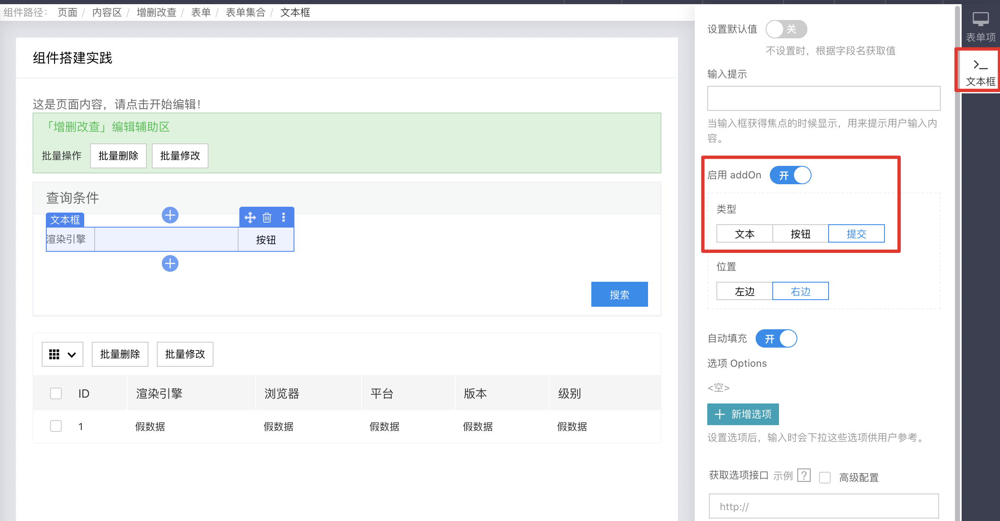

## 组件搭建流程

通过组件搭建完成的页面主要包括两部分：添加组件和配置信息。

### 添加组价

1. 新建一个普通页面，进入页面编辑环境。

2、点击左侧【组件】打开组件面板。

3. 选择一个增删改查组件，并拖拽到页面内容区域。在弹出的页面中配置数据信息：ID、渲染引擎、浏览器、平台、版本、级别。

如果初始状态下未完成字段配置，可以通过点击大纲树中的组件【增删改查】然后右键打开快捷操作。

> 说明：右键快捷操作在编辑器环境下都可以使用，选中的层级和组件不同，支持的操作项也有不同。

4. 配置字段后可以看到如下效果。

5. 然后为页面增加一些基础功能。打开查询条件，添加两个批量操作按钮。

6. 点击左侧编辑区的按钮，在右侧的配置面板中进行操作配置。

7. 然后配置按钮的动作为“发送请求”，并且填入目标 API，并完善确认文案。类似的方法完成批量修改按钮的配置，平台支持 13 种动作类型，能满足主要按钮场景的需求。

8. 下一步配置查询条件，选中查询表单组件，打开右侧配置面板。

9. 完成字段配置和字段名绑定，配置筛选条件为：渲染引擎，字段名为 engine。

10. 在文本框配置中，打开 addOn，按钮类型改为【提交】。

11. 删除 label 就可实现文本框名称显示。

12. 然后保存，这个页面的配置过程就完成了。退出后可看到效果。

> 说明：上述示例中配置的接口是没有数据的，因此表中无数据信息。
