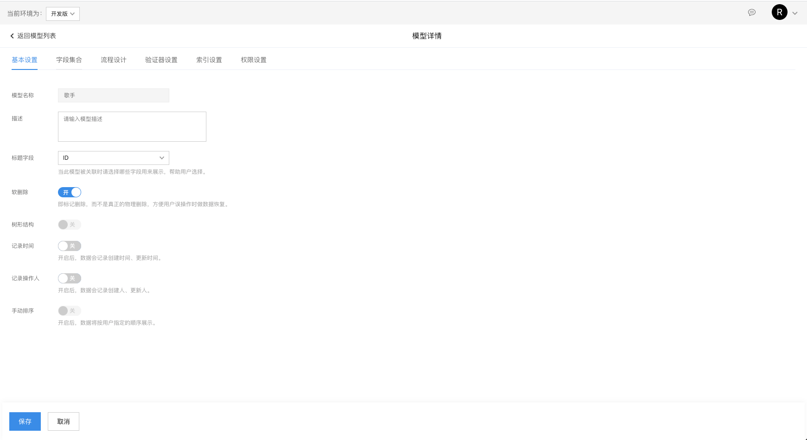
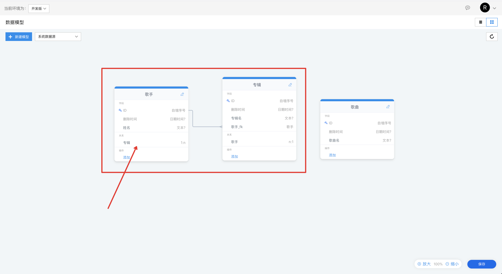
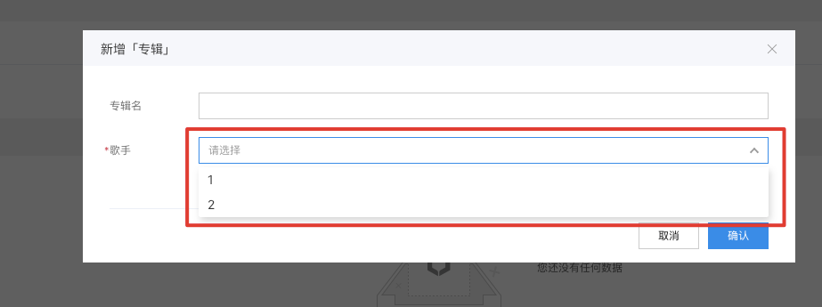
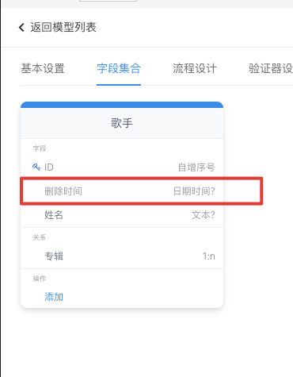
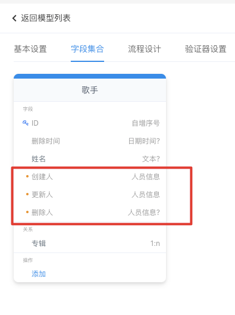

## 数据信息设置

模型编辑主要由 6 个模块构成：基本设置、字段集合、流程设计、验证器设置、索引设置、权限设置。本节主要对基本设置部分进行介绍，其他部分在后续都有详细的介绍。

下面是模型相关的一些基本设置。

### 模型名称

为创建时设置的模型名称，不可修改。

### 描述

模型的描述信息。

### 标题字段

当模型添加关系后，编辑界面中需要勾选互相有关系的模型时，会显示设置的该字段，否则默认就显示 id。

例如下图中，我们给【歌手】添加了一对多关系，目标模型为【专辑】

然后我们给添加两个歌手数据：

然后我们来到【专辑】数据管理界面，点击新增，我们发现选择歌手显示的数据 id，不方便用户选择

来到【歌手】模型编辑界面，调整【歌手】的模型标题字段为`姓名`：

然后再回到【专辑】数据管理界面，点击新增，我们发现选择歌手显示的数据为姓名了：

### 软删除

当前模型是否开启软删除功能。

开启软删除后，会自动给当前模型添加`删除时间`字段，删除数据时并不会真正删除掉，而是会记录当前时间到`删除时间`字段，查询数据时，隐藏有`删除时间`的数据。

> ** 建议开启，方便数据恢复。**

### 树形结构

近期即将支持，敬请期待。

### 记录时间

当前模型是否开启记录时间功能。

开启记录时间后，会自动给当前模型添加`创建时间`和`更新时间`字段。新增和修改数据时会记录当前时间到`创建时间`和`更新时间`字段。

### 记录操作人

当前模型是否开启记录操作人功能。

开启记录操作人后，会自动给当前模型添加`创建人`、`更新人`和`删除人`字段。新增、修改和删除时，会记录当前操作人到`创建人`、`更新人`和`删除人`字段。

### 手动排序

近期即将支持，敬请期待。
