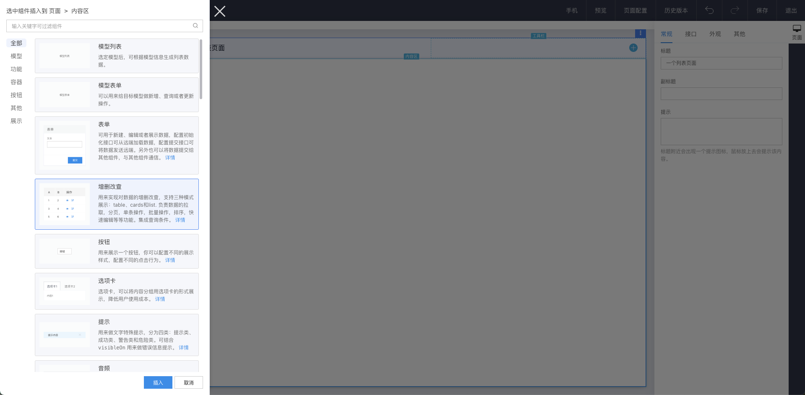
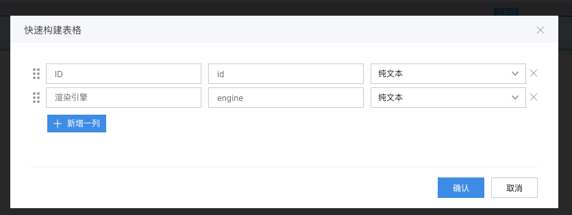
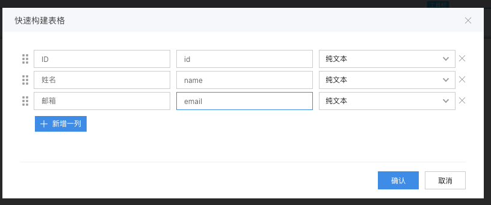
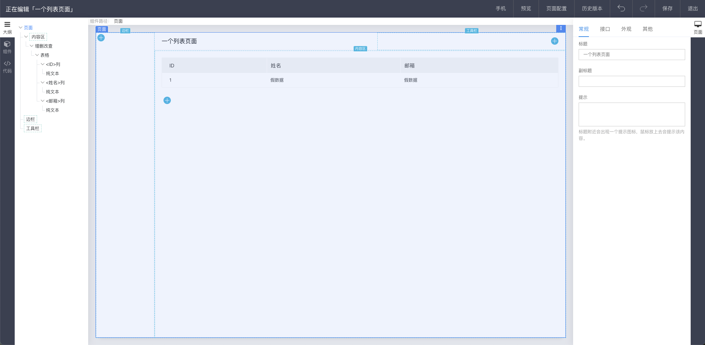
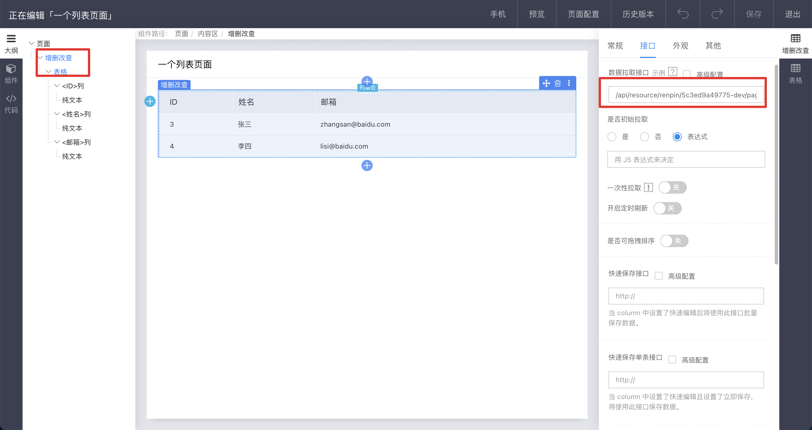

该篇文档介绍如何配置通过接口展示一个表格组件。

## 添加「增删改查」组件

进入页面的可视化编辑器界面，点击加号，新增组件：


选择「增删改查」组件：



进入快速构建，可以快速编辑要展示的列：



每列所配置属性作用分别是：

1. 设置表头显示字段
2. 该列绑定行数据中字段的 `key` 值
3. 选择列展示的类型

我们这里创建三列，分别是：「ID」列（绑定行数据 `id` 字段）、「姓名」列（绑定行数据 `name` 字段）、「邮箱」列（绑定行数据 `email` 字段）。



点击确认后，编辑界面可以看到如下效果：



基本的组件结构已经准备好了，现在我们需要准备数据

## 准备数据接口

准备好一个可用的数据接口，该数据接口返回的数据格式要求如下：

```json
{
  "status": 0,
  "msg": "",
  "data": {
    "items": [
      {
        // 每一行的数据
        "id": 1,
        "xxx": "xxxx"
      }
    ],

    "count": 200 // 注意！！！这里不是当前请求返回的 items 的长度，而是数据库中一共有多少条数据，用于生成分页组件
  }
}
```

- `items`或`rows`：用于返回数据源数据，格式是数组
- `count`: 用于返回数据库中一共有多少条数据，用于生成分页

例如如上，我们配置的表格，我们需要返回的数据结构是：

```json
{
  "status": 0,
  "msg": "",
  "data": {
    "items": [
      {
        "id": 1,
        "name": "张三",
        "email": "zhangsan@xxx.com"
      },
      {
        "id": 2,
        "name": "李四",
        "email": "lisi@xxx.com"
      }
    ],
    "count": 2
  }
}
```

## 绑定数据接口

在编辑器左侧大纲中，选中「增删改查」组件，切换至「接口」标签，将准备好的数据接口，填入到「数据拉取接口」配置中：



点击预览可以看到已经可以顺利渲染出列表页了。


