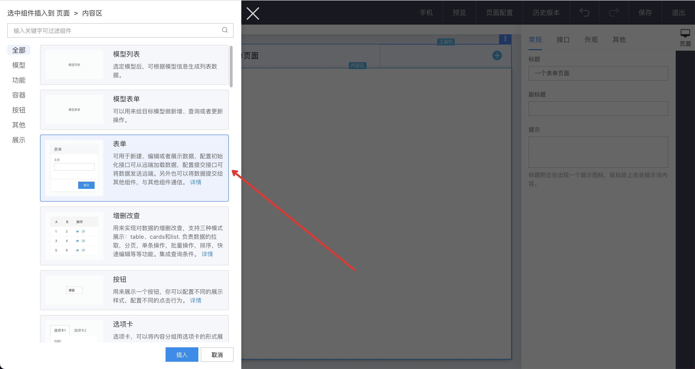
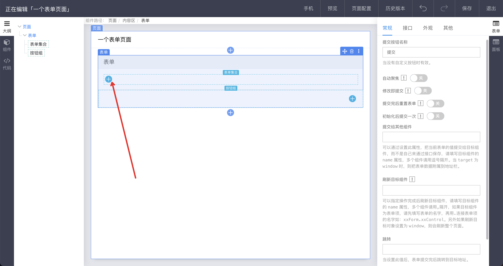
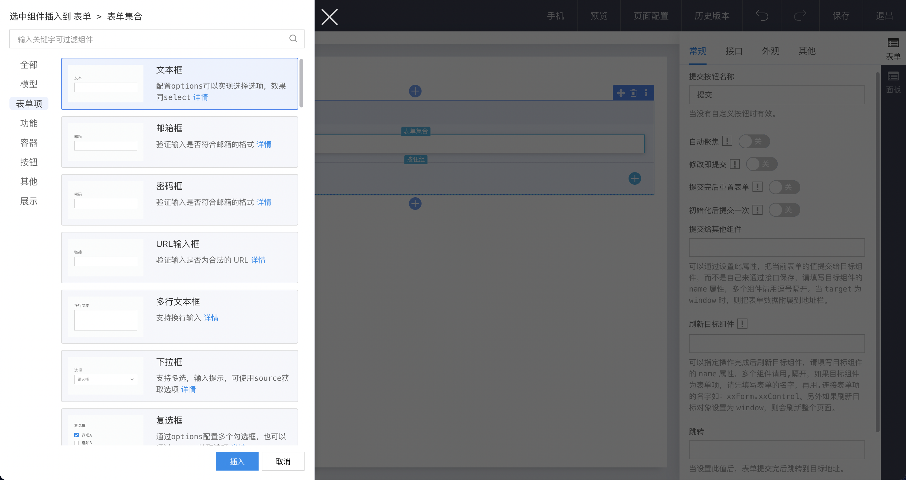
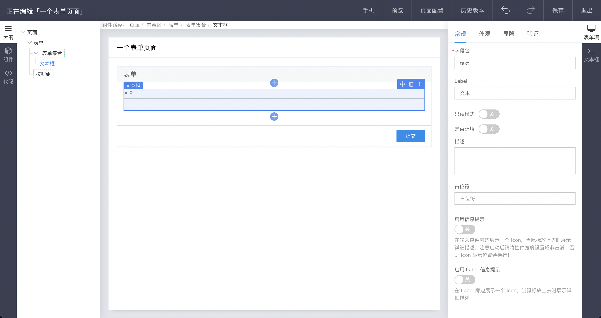
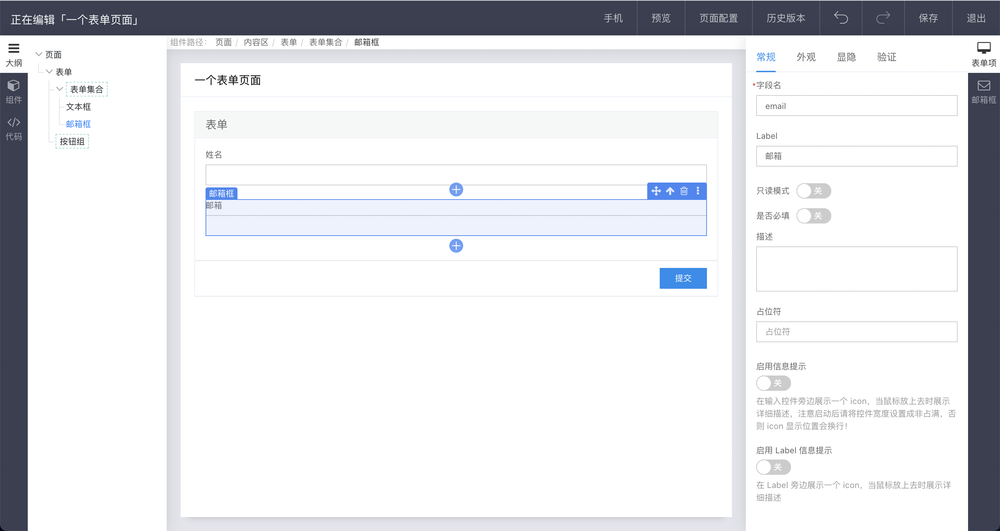
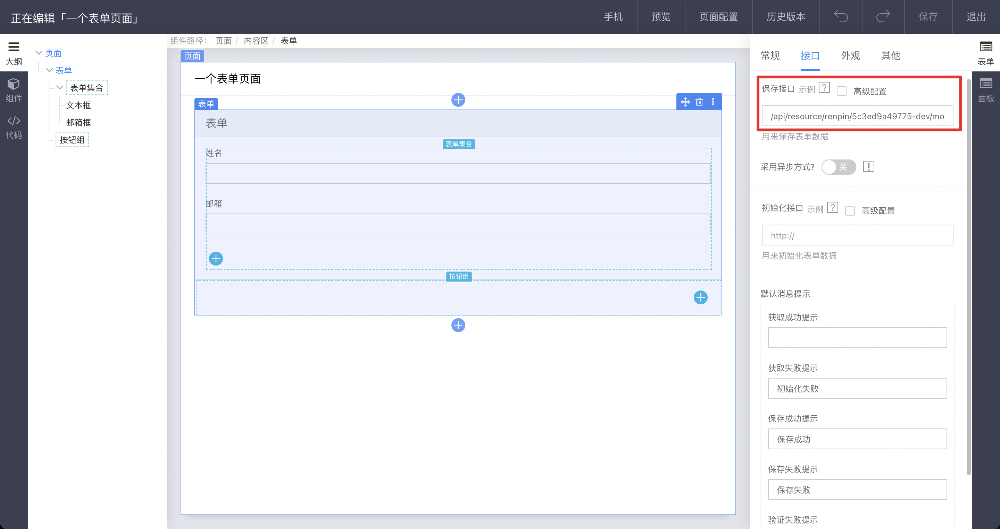

  
该篇文档介绍如何配置一个表单，并将表单数据提交到一个接口上。

## 添加 Form 组件




## 编辑表单项

选中「Form」，然后点击加号，添加表单项。

我们这里添加两个表单项：文本框「姓名」、文本框「邮箱」



选择文本框



添加成功后，选中文本框



编辑文本框字段，修改 「字段名」为 `name`，修改 Label 为 `姓名`


- 字段名代表是提交表单后，提交给后端该数据的 key 值为该配置
- label 表示标识该表单项的文本

同上步骤，添加邮箱表单项：



这样就基本结构就配置成功了：


## 绑定提交接口

准备一个保存接口，用于接收表单提交请求，用来保存数据。

表单提交的数据结构为：

```json
{
  "name": "爱速搭",
  "email": "isuda@baidu.com"
}
```

接口保存后返回的数据结构：

```json
{
  "status": 0,
  "msg": "保存成功",
  "data": {}
}
```

将保存接口填入表单接口配置中：



现在我们来提交一次表单：


到此我们构建了一个简单的 Form 提交。
